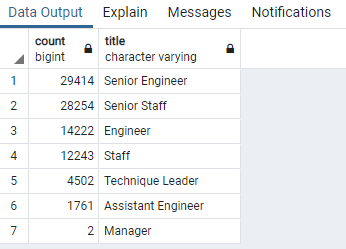
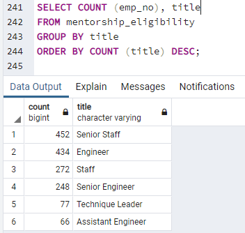

# Pewlett-Hackard-Analysis

## Overview of Project

### Purpose
The purpose of this analysis is to assist Pewlett Hackard and Bobby's manager to prepare for the "silver tsunami" as many current employees inch towards retirement age. 

## Results

Four major points from the two analysis performed during the challenge is as follows:

  * Employees with titles SENIOR ENGINEER, SENIOR STAFF, ENGINEER, STAFF, TECHNIQUE LEADER, ASSISTANT ENGINEER, and MANAGER fall within the retirement pool identified by our birthday constraints
  
  * The majority of employees retiring are either Senior Engineers or Senior staff 
  
  

  * Employees with titles SENIOR STAFF, ENGINEER, STAFF, SENIOR ENGINEER, TECHNIQUE LEADER, and ASSISTANT ENGINEER are eligible for mentorship identified by our birthday constraints
  
  * The number of employees available to mentor is significantly fewer than the number of employees retiring
  
  
  
### Summary

**How many roles will need to be filled as the "silver tsunami" begins to make an impact?**

Referencing the images cited above in the results section, a total of 29414 Senior Engineers, 28254 Senior Staff, 14222 Engineers, 12243 Staff, 4502 Technique Leader, 1761 Assistant Engineer, and 2 Managers will be retiring and these roles will need to be filled by a wave of next generation new hires. 

**Are there enough qualified, retirement-ready employees in the departments to mentor the next generation of Pewlett Hackard employees?**

Again referencing the images cited above in the results section, a total of 452 Senior Staff, 434 Engineers, 272 Staff, 248 Senior Engineers, 77 Technique Leaders, and 66 Assistant Engineers are available and eligible for mentorship, which is vastly under the number of roles that need to be filled as a result of retirement. This will likely make business continuity and transition of roles and responsibility quite a difficult task for Pewlett-Hackard. 

In order to generate the number of mentors based on title, I utilized the following query that was not covered as part of module 7 

```
SELECT COUNT (emp_no),title
FROM mentorship_eligibility
GROUP BY title
ORDER BY COUNT (title) DESC;
```
A second query that may generate more insight into the upcoming silver tsunami would be to analyze the retirement population based on gender. In order to achieve this, I created the following queries by tweaking existing queries from the challenge:

```
SELECT e.emp_no, 
    e.first_name, 
    e.last_name,
	e.gender,
    tit.title,
    tit.from_date,
    tit.to_date
INTO retirement_genders
FROM employees as e 
INNER JOIN titles as tit 
ON (e.emp_no = tit.emp_no)
WHERE (e.birth_date BETWEEN '1952-01-01' AND '1955-12-31')
ORDER BY emp_no;

SELECT DISTINCT ON (emp_no) emp_no,
first_name,
last_name,
title,
gender
INTO genders
FROM retirement_genders
ORDER BY emp_no, to_date DESC;

SELECT COUNT (emp_no), gender
FROM genders
GROUP BY gender;
```

The above queries informed me that 54140 M will be retiring during the silver tsunami while 36258 F will be retiring, signifying that the number of male retirees is greater than female retirees. This may provide me insight on the type of hires occuring in the earlier generation, where gender equality may not have been as advanced as present day. 


